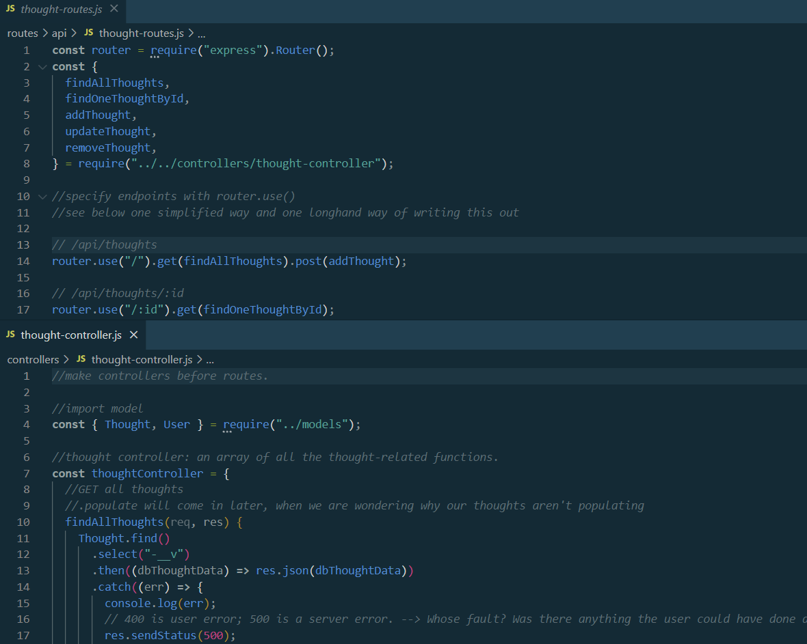

# pop-in

Module 18 Challenge

## Description

Why not pop in? Pop in for a cuppa, pop in for a chat. Pop-In is a social media network web app that allows users to make friends, share thoughts, and reply to their friends' thoughts.

## Table of Contents

- [Installation](#installation)
- [Usage](#usage)
- [Packages](#packages)
- [Screenshot](#screenshot)
- [Demo Video(s)](#demo-videos)

### Installation

1. Clone or download code.
2. Open terminal.
3. Run "npm i express"
4. Run "npm i mongoose."

### Usage

1. Open terminal
2. Run "node server"
3. Open Insomnia
4. Test routes:

- "GET,"
- "POST,"
- "PUT,"
- "DELETE."
- Note: Run "GET" twice, once without ID endpoint and once with ID endpoint, to see "get all" and "get one."

### Packages

- Express
- Mongoose

### Screenshot

### Demo Video(s)

### Contributers

Created by Renee Hamlin, with grateful acknowledgement to the assistance and support of tutors Sean New and Jacob Carver.